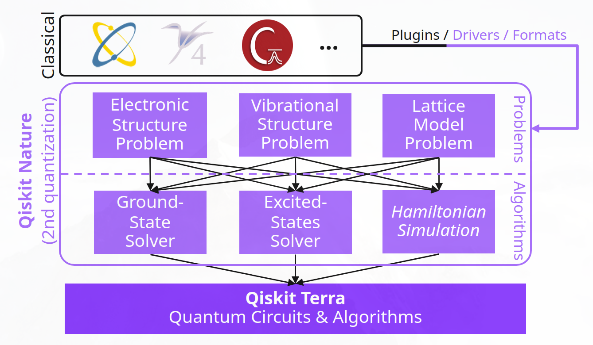

Qiskit Nature v0.5 Migration Guide
==================================

This tutorial will guide you through the process of migrating your code
from Qiskit Nature v0.4 to v0.5

Overview
--------

Let us begin with an overview of the refactored design. A major
motivator for the refactoring of Qiskit Nature was the goal of readying
Qiskit Nature for more and tighter integrations with other
classical-computational codes. In order to achieve this in the most
modular and maintainable manner, we had to decouple the representation
of our ``BaseProblem`` from our ``BaseDriver`` classes.

This led to the following abstract design of the Qiskit Nature package:
|Qiskit Nature 0.5|

As you can see, the package is logically divided into two concepts:

1. **problems**: which are representations of scientific problems to
   which one seeks a solution
2. **algorithms**: which provide the means to find solutions to said
   problems

In each of these cases, Qiskit Nature has three pillars:

1. **problems**:

   1. *Electronic Structure Problem*: representing the problem of the
      electronic Schrödinger equation of molecular systems
   2. *Vibrational Structure Problem*: representing the problem posed by
      the Watson Hamiltonian of molecular systems
   3. *Lattice Model Problem*: representing problems defined on lattices

2. **algorithms**:

   1. *Ground State Solver*: for finding the ground state of a problem
   2. *Excited States Solver*: for finding excited states of a problem
   3. *Hamiltonian Simulation*: to simulate dynamics of a problem
      (*planned for v0.6*)

Some of these concepts have already been present in earlier versions of
Qiskit Nature, but were not as clearly separated. Furthermore, the
integration with classical codes has been very restrictive in older
versions, limiting not only the potential applications of such
integrations, but also the capabilities of our ``BaseProblem``
representation, and its usage in the remainder of the package.

How to use this guide
---------------------

This guide is split across multiple files allowing you to discover the
changes between v0.4 and v0.5 to each submodule as you find the need.
That means, you do not need to read all of the details at once and
jumping around is highly encouraged.

Generally speaking the refactoring largely relocated any code from
``qiskit_nature.X.second_quantization`` to ``qiskit_nature.second_q.X``.
This should help you navigate the source code for most cases. However,
in some specific cases we have re-categorized specific modules/classes,
so be advised to look into the guides for more details below.

To understand what files you need to pay attention to, please carefully
review the following list of topics:

-  `Solving any problem <./0.5_b_solving_problems.ipynb>`__
-  `Electronic Structure
   Problems <./0.5_c_electronic_structure.ipynb>`__
-  `Vibrational Structure
   Problems <./0.5_d_vibrational_structure.ipynb>`__
-  `Lattice Model Problems <./0.5_e_lattice_models.ipynb>`__
-  `Protein Folding <./0.5_f_protein_folding.ipynb>`__

Some important general notes
----------------------------

Too many positional arguments
~~~~~~~~~~~~~~~~~~~~~~~~~~~~~

With Qiskit Nature v0.5 we have started to require certain arguments in
the public API to be **keyword-only** arguments. This change was
motivated by the following advantages:

-  improved readability: in the example given below, it is immediately
   clear what a given argument does
-  improved forwards compatibility: adding more arguments in the future
   will be a lot simpler because keyword arguments are not
   order-dependent

That means, even if you only need to update the import path during your
migration process, you may run into errors like the following:

Previously
^^^^^^^^^^

.. code:: ipython3

    from qiskit_nature.mappers.second_quantization import LogarithmicMapper

    mapper = LogarithmicMapper(2)

Now we update the import path to the new location and obtain an error:

.. code:: ipython3

    from qiskit_nature.second_q.mappers import LogarithmicMapper

    mapper = LogarithmicMapper(2)

::

    ---------------------------------------------------------------------------

    TypeError                                 Traceback (most recent call last)

    <ipython-input-2-74b842b89d77> in <module>
          1 from qiskit_nature.second_q.mappers import LogarithmicMapper
          2
    ----> 3 mapper = LogarithmicMapper(2)

    TypeError: __init__() takes 1 positional argument but 2 were given

If this happens to you, we suggest that you simply check the
documentation of the class which you are trying to use. It is very
likely that only need to change from using an argument *positionally* to
using it with a **keyword**. For example like so:

New
^^^

.. code:: ipython3

    from qiskit_nature.second_q.mappers import LogarithmicMapper

    mapper = LogarithmicMapper(padding=2)

Unexpected number of orbitals or qubits
~~~~~~~~~~~~~~~~~~~~~~~~~~~~~~~~~~~~~~~

With Qiskit Nature v0.5 we have switched the entire stack over from
using ``num_spin_orbitals`` to instead use ``num_spatial_orbitals``. The
motivation behind this, was that the behavior when specifying an odd
number of spin orbitals was ill-defined and not guarded against,
potentially causing surprising results. By switching to the number of
spatial orbitals (which then get multiplied by 2 to yield the total
number of spin orbitals), this problem can no longer arise.

So if you do encounter some unexpected number of orbitals and/or qubits
in your results, be sure to check whether you need to update your input.
For example like shown below:

Previously
^^^^^^^^^^

.. code:: ipython3

    from qiskit_nature.circuit.library import HartreeFock
    from qiskit_nature.converters.second_quantization import QubitConverter
    from qiskit_nature.mappers.second_quantization import JordanWignerMapper

    converter = QubitConverter(JordanWignerMapper())

    init_state = HartreeFock(num_spin_orbitals=6, num_particles=(2, 1), qubit_converter=converter)
    print(init_state.draw())

.. parsed-literal::

         ┌───┐
    q_0: ┤ X ├
         ├───┤
    q_1: ┤ X ├
         └───┘
    q_2: ─────
         ┌───┐
    q_3: ┤ X ├
         └───┘
    q_4: ─────

    q_5: ─────

New
^^^

.. code:: ipython3

    from qiskit_nature.second_q.circuit.library import HartreeFock
    from qiskit_nature.second_q.mappers import JordanWignerMapper, QubitConverter

    converter = QubitConverter(JordanWignerMapper())

    init_state = HartreeFock(num_spatial_orbitals=3, num_particles=(2, 1), qubit_converter=converter)
    print(init_state.draw())

.. parsed-literal::

         ┌───┐
    q_0: ┤ X ├
         ├───┤
    q_1: ┤ X ├
         └───┘
    q_2: ─────
         ┌───┐
    q_3: ┤ X ├
         └───┘
    q_4: ─────

    q_5: ─────

